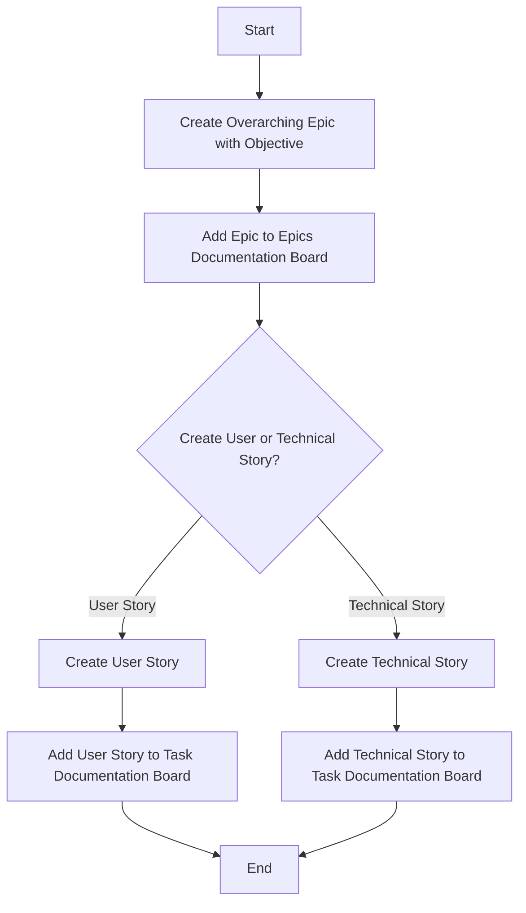

# Epic and Story Creation Workflow

## Background

In our Agile-based development process, we use **Epics** and **Stories** (User & Technical) to manage and track our work. Epics are overarching tasks or themes, broken down into more specific User or Technical Stories. This approach ensures manageable, trackable tasks that align with our project goals.

### User Stories in Agile

- **What are User Stories?**: Descriptions of software functionality from the end-user's perspective. They focus on the user's need rather than detailing the feature itself.
- **Format**: "As a [type of user], I want to [perform some action] so that [I achieve some reason or benefit]."
- **Role in Agile**: User Stories are fundamental to Agile frameworks, emphasizing user needs, collaboration, and value delivery. They form the core elements of backlogs in Scrum and Kanban methodologies.

### Technical Stories

- **Definition**: Technical Stories describe the tasks or functionalities from a technical perspective. These stories are more about the technical implementation and requirements necessary to achieve the goals outlined in the User Stories or the Epic.
- **Use in Our Workflow**: In our context, Technical Stories serve as tasks that detail the technical aspects necessary for the implementation of an Epic or User Story. They may include backend developments, database configurations, or other technical tasks.

### Epics, Stories, and Tasks

- **Epics**: Larger bodies of work encompassing multiple User and/or Technical Stories.
- **User Stories**: Specific functionalities or features described from an end-user's perspective.
- **Tasks**: Specific segments or steps within a Story, particularly a Technical Story.

## Workflow

### Workflow Diagram

### Steps
**Note:** there are issue templates for epics and stories that you can use.
1. **Create Epic**: Define an overarching task or theme.
2. **Add Epic to 'Epics Documentation' Board**: Provide visibility and tracking for the Epic.
3. **Determine Story Types**: Decide if the Epic contains User Stories, Technical Stories, or both.
4. **Create User/Technical Stories**: Break down the Epic into actionable stories/tasks.
5. **Add Stories to 'Task Documentation' Board**: Track the progress of each story from backlog to completion.
6. **Implement Stories**: Work on the stories, adhering to the requirements and goals set forth by the Epic.
7. **Review, Test, and Document Stories**: Upon completion, thoroughly document the work, including code screenshots, notes, and related feature branches.
8. **Check Completion of All Stories**: Once all stories under an Epic are completed, the Epic can be closed.
9. **Close Epic**: Mark the Epic as complete in the 'Epics Documentation' Board.

## Conclusion

This workflow integrates Agile principles into our project management, emphasizing clear, structured, and trackable tasks. It aligns with our goal of maintaining focus, collaboration, and efficiency throughout the development process.
